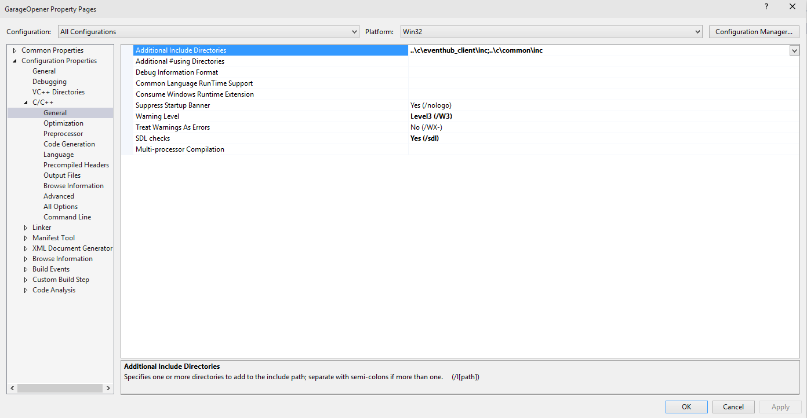
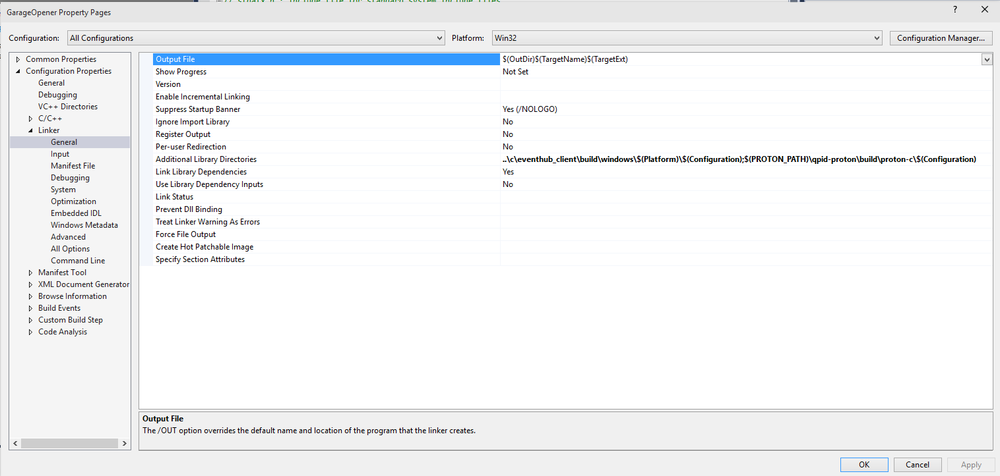
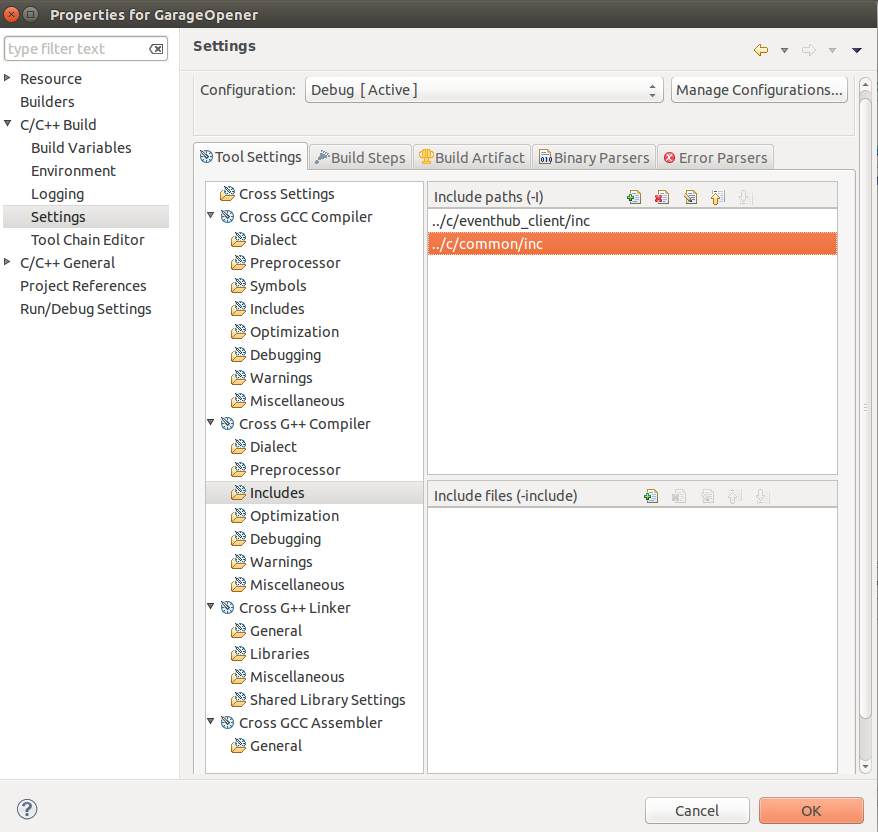
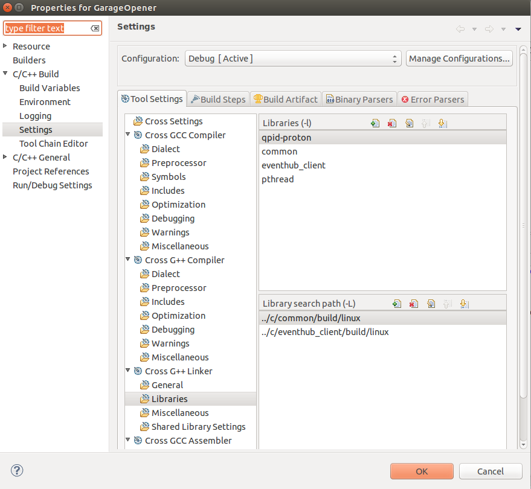

> This document is known to be outdated

# How to create an Azure EventHub client application from scratch

This document describes how to create a client application that uses the *Microsoft Azure Event Hub Client for C* to communicate with the Azure Event Hub service. It uses a garage door opener as the example device to implement and shows you how to create a Visual Studio project to build a client to run on Windows and an Eclipse project to build a client to run on Ubuntu.

## Visual Studio

This section shows you how to use Visual Studio to build an Event Hub client application to run on Windows.

### Prerequisites

Before you begin, you should ensure that your local development environment meets these prerequisites:

- Clone the latest version of the [azure-event-hubs](https://github.com/Azure/azure-event-hubs) repository to your local machine.
- Ensure the Windows samples in the [azure-event-hubs](https://github.com/Azure/azure-event-hubs) repository build successfully:
  - Open a Visual Studio command prompt on your local machine.
  - Navigate to the folder **build_all\Windows** in your local copy of the repository.
  - Run the **build.cmd** script.

### Create the project

The following steps show you how to create an Event Hub client application project in Visual Studio.

1. Create a C++ Win32 Console Application project named **GarageOpener** in the root folder of your local copy of the azure-event-hubs repository.  Uncheck the **Create directory for solution** option. If you choose to create this project in a different location on your local machine, you must adjust the paths in the subsequent steps accordingly.
2. In Solution Explorer, right-click on the **GarageOpener** project and then click **Properties** to display the project property sheet.
3. Expand **Configuration Properties**, expand **C/C++**, and then click **General**. Add  **..\c\eventhub_client\inc;..\c\common\inc** to **Additional Include Directories**.

4. Click **Preprocessor** and add **\_CRT_SECURE_NO_WARNINGS** to the **Preprocessor Definitions**.
5. Expand **Linker** and then click **General**. Add  **..\c\eventhub_client\build\windows\$(Platform)\$(Configuration)** to **Additional Library Directories**.

6. Click **Input** and add **eventhubclient.lib** to **Additional Dependencies**.
7. Click **Save** to save your project configuration changes.
8. Open the file **stdafx.h** and add references to the iothub client header files:

		#include "eventhubclient.h"
		#include "eventdata.h"

9. Save the changes to **stdafx.h**. (At this point it's a good idea to compile your project to make sure includes and link configuration are working properly).
10. Open the file **GarageOpener.cpp**.
11. See the "Appendix: Garage Door Opener code sample" for the domain specific code you need to add to **GarageOpener.cpp** to implement the garage door opening behavior.

## Eclipse

This section shows you how to use Eclipse to build an Event Hubs client application to run on Ubuntu.

### Prerequisites

Before you begin, you should ensure that your local development environment meets these prerequisites:

- Clone the latest version of the [azure-event-hubs](https://github.com/Azure/azure-event-hubs) repository to your local machine.
- Install the required packages:

		sudo apt-get install uuid uuid-dev cmake libcurl4-openssl-dev g++

- Ensure the Linux samples in the [azure-event-hubs](https://github.com/Azure/azure-event-hubs) repository build successfully:
  - Open a terminal window and navigate to **build_all/linux/** in your local copy of the repository.
  - Run the **build.sh** script.

### Create the project

1. Create an Eclipse **Hello World C++ Project Application** project named **GarageOpener** in the root folder of your local copy of the azure-event-hubs repository.
2. In the Project Explorer, right-click on the **GarageOpener** project, click **Properties**, expand **C/C++ Build**, and then click **Settings**.
3. Expand **Cross C++ Compiler**, then click **Includes**. Add **../../c/eventhub_client/inc** and **../../c/common/inc** as include paths.

4. Expand **Cross C++ Linker**, then click **Libraries**. Add **../../c/eventhub_client/build/linux** and  **../../c/common/build/linux** to the **Library search path**.
5. Add **eventhub_client**, **common**, and **pthread** to **Libraries**.

6. Click **OK** to save your changes.
7. Open the file **GarageOpener.cpp** and add **include** statements for the event hub client header files:

		#include "eventhubclient.h"
		#include "eventdata.h"

8. Add the following standard **include** statement:

		#include <crt_abstractions.h>

9. Save the changes to **GarageOpener.cpp**. At this point it's a good idea to try to compile the project to check if the **include** statements and library paths are correct.
10. See the "Appendix: Garage Door Opener code sample" for the domain specific code you need to add to **GarageOpener.cpp** to implement the garage door opening behavior.

## Appendix: Garage Door Opener code sample

This appendix contains the C++ source code to add to **GarageOpener.cpp** in Visual Studio or Eclipse to implement the domain specific garage door opening behavior.

```
// GarageOpener.cpp : Defines the entry point for the console application.

static const char* connectionString = "<Your Connection String Goes Here.>";
static const char* eventHubPath = "<Your EventHub Path Goes Here.>";

#define MAX_TELEMETRY_MSG		256

typedef enum GarageDoorActionCodes_tag
{
	DOOR_MISALIGNMENT,
	DOOR_OBSTRUCTION,
	LOW_BATTERY,
	GARAGE_DISCONNECTED_FROM_DOOR,
	DOOR_OPEN,
	DOOR_CLOSE,
} GarageDoorActionCodes;

GarageDoorActionCodes WaitForDoorSensorsStatus(int* msgCode)
{
	GarageDoorActionCodes code = DOOR_MISALIGNMENT;
	// TODO: Code to read sensors for Garage door
	getchar();
	return code;
}

static bool SendDoorMessageToAzure(EVENTHUBCLIENT_HANDLE eventHubClientHandle, EVENTDATA_HANDLE dataHandle)
{
	bool result;

	if (EventHubClient_Send(eventHubClientHandle, dataHandle) != EVENTHUBCLIENT_OK)
	{
		result = false;
	}
	else
	{
		result = true;
	}

	return result;
}

int main(int argc, char* argv[])
{
	int result = 0;
	EVENTHUBCLIENT_HANDLE eventHubClientHandle = EventHubClient_CreateFromConnectionString(connectionString, eventHubPath);


	char telemetryMsg[MAX_TELEMETRY_MSG];
	int msgCode = 0;
	do
	{
		GarageDoorActionCodes actionCode = WaitForDoorSensorsStatus(&msgCode);
		EVENTDATA_HANDLE eventDataHandle;
		switch (actionCode)
		{
		case DOOR_MISALIGNMENT:
			sprintf_s(telemetryMsg, MAX_TELEMETRY_MSG, "DOOR_MISALIGNMENT_%d", msgCode);
			break;
		case DOOR_OBSTRUCTION:
			sprintf_s(telemetryMsg, MAX_TELEMETRY_MSG, "DOOR_OBSTRUCTION_%d", msgCode);
			break;
		case LOW_BATTERY:
			sprintf_s(telemetryMsg, MAX_TELEMETRY_MSG, "LOW_BATTERY_%d", msgCode);
			break;
		case GARAGE_DISCONNECTED_FROM_DOOR:
			sprintf_s(telemetryMsg, MAX_TELEMETRY_MSG, "GARAGE_DISCONNECTED_FROM_DOOR_%d", msgCode);
			break;
		case DOOR_OPEN:
			sprintf_s(telemetryMsg, MAX_TELEMETRY_MSG, "DOOR_OPEN_%d", msgCode);
			break;
		case DOOR_CLOSE:
			sprintf_s(telemetryMsg, MAX_TELEMETRY_MSG, "DOOR_CLOSE_%d", msgCode);
			break;
		}

		eventDataHandle = EventData_CreateWithNewMemory((const unsigned char*)telemetryMsg, strlen(telemetryMsg));
		if (eventDataHandle == NULL)
		{
			(void)printf("ERROR: eventDataHandle is NULL!\r\n");
			result = -1;
			break;
		}
		else
		{
			if (EventHubClient_Send(eventHubClientHandle, eventDataHandle) != EVENTHUBCLIENT_OK)
			{
				(void)printf("ERROR: EventHubClient_Send failed!\r\n");
				result = -1;
				break;
			}
			else
			{
				(void)printf("EventHubClient_Send.......Successful\r\n");
				result = 0;
			}
			EventData_Destroy(eventDataHandle);
		}

	} while (true);

	EventHubClient_Destroy(eventHubClientHandle);
	return result;
}

```
