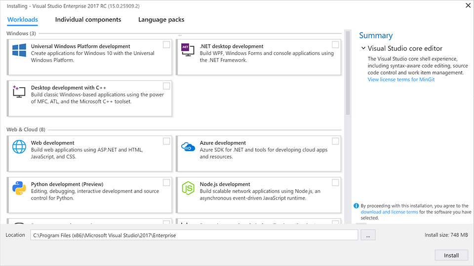
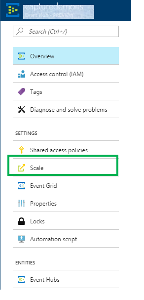
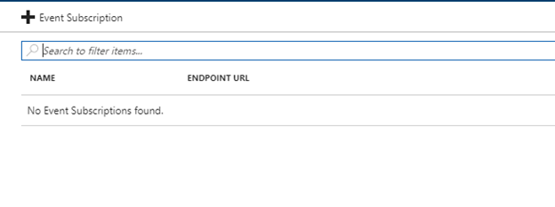
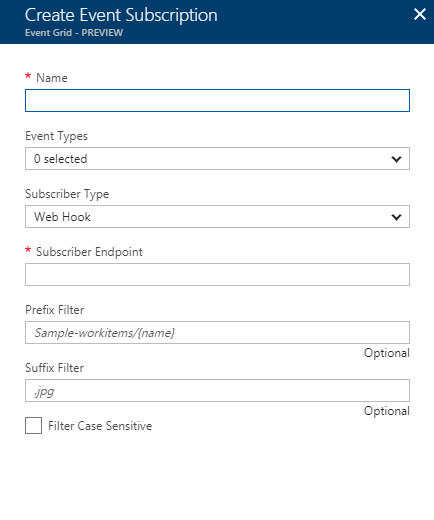

# An overview, how Event Hubs Capture integrates with Event Grid 

One of the key scenarios for modern cloud scale apps is seamless integration and notification amongst other apps and services. In this blog post, we introduced [Azure EventGrid](https://azure.microsoft.com/blog/introducing-azure-event-grid-an-event-service-for-modern-applications/) (in public preview), a service designed just for that!
Today, we will go over a realistic scenario of capturing Azure EventHub data into a SQL Database Warehouse and demonstrate the power and simplicity of using [Azure EventGrid](https://docs.microsoft.com/azure/event-grid/overview) to achieve this.

So, fasten your seat belts…
*	First, we turn on Capture on Azure Event Hub with Azure blob storage as destination. This generates Azure storage blobs containing EventHub data in Avro format.
*	Next, we create an Azure EventGrid subscription with source as the Azure EventHub namespace and the destination as an Azure WebJob Function.
*	Whenever a new Avro blob file is generated by Azure EventHub Capture, Azure EventGrid notifies or shoulder-taps the Azure WebJobs Function with info about the blob (the blob path etc.). The Function then does the required processing to dump the data to a SQL Database data warehouse.

That is it! There are no worker services involved in polling for these Avro blobs. This means no management overhead and significantly lower COGS, especially in a cloud-scale production environment!

The sample code for this scenario is here. It consists of a solution with projects that do the following
a.	WindTurbineDataGenerator – a simple publisher for wind turbine data, that sends the interested data to your EventHub which has Capture enabled on it
b.	FunctionDWDumper – This Azure Functions project receives the EventGrid notification about each Capture Avro blob created. This gets the blob’s Uri path, reads its contents and pushes this data to a SQL Database data warehouse.

# Prerequisites
*	[Visual studio 2017 Version 15.3.2 or greater](https://www.visualstudio.com/vs/)
*	While installing, ensure that you install the following workloads: .NET desktop development, Azure development, ASP.NET and web development, Node.js development, Python development

# Detailed steps
1. Deploy the infrastructure for this solution by using the [sample template](https://raw.githubusercontent.com/Azure/azure-docs-json-samples/master/event-grid/EventHubsDataMigration.json).
2. Build the solution
3. Run WindTurbineDataGenerator.exe. This creates an event hub with Capture turned on, dumping Avro blobs periodically
4. Publish your function app

## Create an Azure Function endpoint

Publish your function from Visual Studio to the function app you deployed with the template Once you finish this, click on the "Get function URL" in the top right of the function. Copy this url - you will need it in the next step when you create the Event Grid subscription, as you want to specify this Function endpoint as your destination endpoint for the Event Grid subscription that you will be creating.

## Create an Azure SQL Data Warehouse resource
Create a table with the schema speicified in CreateDataWarehouseTable.sql under scripts

## Create an Event subscription
Now that you have created the endpoint where we want notification, it is time to create Event subscription so you can route and filter events. Note, this users the already existing Event Hubs namespcace described earlier.
An Event subscription can be created either through the portal or using Azure CLI. Below, describes both scenarios.

### Using portal
In the overview blade of your previously created Event Hubs namespace, select Event Grid and click on add subscription as show below

In the Create Event subscription blade, fill in the details and click on create,

Note: When you select the Event Types, you are specifying that Event Grid notifies the Subscriber endpoint which in this case is the Azure functions url, each time Event Hubs Capture creates a blob entry in the storage

## Observe the data populated in the SQL Data Warehouse
Once the above steps are complete, data should now be populated in the data warehouse. I.e. EventGrid notifies Azure Function which then dumps the data to the data warehouse.  You can use powerful data visualization tools with your data warehouse to achieve your Actionable insights.

This article shows how to use [Power BI with SQL Data Warehouse](https://docs.microsoft.com/azure/sql-data-warehouse/sql-data-warehouse-integrate-power-bi)

Now you are all set to plug in the UI you need to get valuable business insights for your management.

# Conclusion
Looking forward to you trying out this sample and providing us your feedback. We would also love to see pull requests

We'll be providing more samples as we understand newer scenarios that your encounter.
So, please stay tuned to much more from the Azure EventHubs/EventGrid team. Ciao!

 
 

